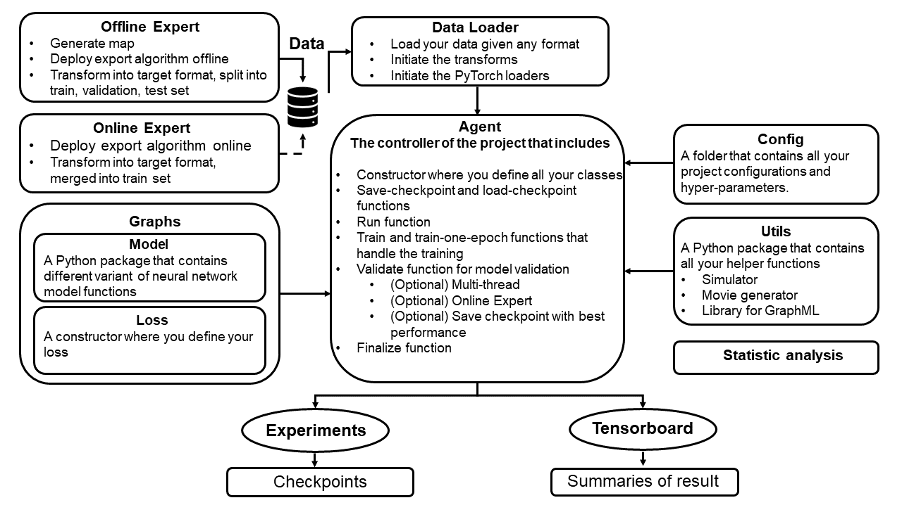

# Message-Aware Graph Attention Network for Large-Scale Multi-Robot Path Planning
This is the official repository for our paper published at IEEE Robotics and Automation Letters [Message-Aware Graph Attention Network for Large-Scale Multi-Robot Path Planning](https://ieeexplore.ieee.org/abstract/document/9424371/).


If our work helps your research, please kindly cite our paper:
```
Q. Li, W. Lin, Z. Liu and A. Prorok, "Message-Aware Graph Attention Networks for Large-Scale Multi-Robot Path Planning," in IEEE Robotics and Automation Letters, vol. 6, no. 3, pp. 5533-5540, July 2021, doi: 10.1109/LRA.2021.3077863.
```
and potentially the fundamental paper as well:
```
Q. Li, F. Gama, A. Ribeiro and A. Prorok, "Graph Neural Networks for Decentralized Multi-Robot Path Planning," 2020 IEEE/RSJ International Conference on Intelligent Robots and Systems (IROS), 2020, pp. 11785-11792, doi: 10.1109/IROS45743.2020.9341668.
```


### Table of Contents: 
<!-- Table of contents generated generated by http://tableofcontent.eu -->
- [Graph MAPF project](#pytorch-project-template)
    
    - [Framework Structure](#repo-structure)
    - [Code Structure](#code-structure)
    - [How to use this repo](#use-repos)
    - [Guideance](#Guideance)
    -- [Requirements](#requirements)
    -- [Step-Through Example](#Step-Through Example)
    - [License](#license)
    - [Citation](#Citation)


## Framework Structure

## Code Structure

The repo has the following structure:
```
├── agents (overall framework for training and testing)
|  └── base.py
|  └── decentralplannerlocal.py
|  |        (DCP with GNNs) 
|  └── decentralplannerlocal_OnlineExpert.py
|  |        (DCP with GNNs and online expert mechanism) 
|  └── decentralplannerlocal_OnlineExpert_LoadPretrained.py
|  |        (Load pre-trained models) 
|  └── decentralplannerlocal_OnlineExpert_GAT.py (*used in the paper)
|  |        (DCP with GATs and online expert mechanism) 
|  └── decentralplannerlocal_OnlineExpert_GAT_LoadPretrained.py
|  |        (Load pre-trained models) 
|  └── decentralplannerlocal_OnlineExpert_GAT_returnGSO.py
|           (save GSO when predicting for the use of visualization) 
|
├── configs (set up key parameters for training and inference stage)
|  └── dcp_ECBS.json
|  └── dcp_OE_Random.json
|  └── dcpGAT_OE_Random.json
|  └── dcpGAT_OE_Random_returnGSO.json
|
├── dataloader (load data for training)
|  └── Dataloader_dcplocal_notTF_onlineExpert.py
|  |       (the dataloader that loads the current state and expert's next step
|  |       to allow imitation model training)
|  └── Dataloader_dcplocal_notTF_onlineExpert_LoadMemory.py
|  |       (the same as the above one but loads the dataset into memory
|  |       to allow faster training in GPU machines where 
|  |       file loading speed is limited by clusters)
|  └── statetransformer_Guidance.py
|          (Transform the solution file (.yaml) into a 3-channel tensor, where different guidance as an option. )
|
├── graphs 
|  └── models (PyTorch models)
|  |  |
|  |  └── decentralplanner.py (CNN->GNN->MLP)
|  |  └── decentralplanner_bottleneck.py (+bottleneck)
|  |  └── decentralplanner_bottleneck_SkipConcatGNN.py (+bottleneck+skip connection (concat features before MLP))
|  |  └── decentralplanner_bottleneck_SkipAddGNN.py (+bottleneck+skip connection (add features before MLP))
|  |  |
|  |  |
|  |  └── decentralplanner_GAT.py (CNN->GAT->MLP)
|  |  └── decentralplanner_GAT_bottleneck.py (+bottleneck)
|  |  └── decentralplanner_GAT_bottleneck_SkipConcatGNN.py (+bottleneck+skip connection (concat features before MLP))
|  |  └── decentralplanner_GAT_bottleneck_SkipAddGNN.py (+bottleneck+skip connection (add features before MLP))
|  |  |
|  |  |
|  |  └── resnet_pytorch.py (codes for ResNet modules)
|  |
|  └── losses
|     └── cross_entropy.py
|     └── label_smoothing.py (label smoothed version of cross-entropy)
|     └── (some other useful functions)
|
├── utils
|  |
|  └── assets
|  |  └── dataTools.py
|  |  └── graphML.py
|  |  └── graphTools.py
|  |
|  └── multirobotsim_dcenlocal_onlineExpert_distributed_action.py 
|  └──      (simulator for decentral agents with online expert mechanism, where failure is saved.)
|  └── visualize.py 
|  └──      (visualize the predicted path with communication link.)
|  └── visualize_expertAlg.py
|  └──      (visualize the ground-truth path.)
|  └── metrics.py 
|  └──      (Record statistics during inference stage.)
|  └── config.py 
|  └── new_simulator.py 
|  └──      (simulation environment, speedup version)
|
├── offlineExpert
|  |
|  └── CasesSolver.py
|  └──       1, (# generate map) Randomly generate a map with customized obstacle density and obstacle, 
|  └──       2. (# case under a map)
|  └──           At each specific map, generate random pairs of start and goal positions for each agent.
|  └──       3. (for given case) Apply expert algorithm to compute solution.
|  |
|  └── DataGen_Transformer.py
|  └──      (Transform the solution into a specific data format that ready to be loaded by the dataloader.
|  └──          including: map, input tensor with each agents paths, GSO.)
|
├── onlineExpert
|  |
|  └── ECBS_onlineExpert.py
|  └──      (Apply expert algorithm to compute solution for failure cases recorded during the training process.)
|  |
|  └── DataTransformer_local_onlineExpert.py
|  └──      (Transform the solution into a specific data format, and then merged it into the offline dataset.)
|
├── experiments
|
├── data
|
├── statistic_analysis 
|  └── (Fig.3.) result_analysis_errorbar.py 
|  └── (Fig.4.) result_analysis_generalization_colormap.py
|  └── (Fig.5.) result_analysis_hist_impact_3K.py
|
├──  main_test.py
|  └──      (run multi-scenario at the same scripts.)
|
└──  main.py


```


## Guideance
### Requirements
```
seaborn>=0.11.1
easydict>=1.9
matplotlib>=3.3.3
numpy>=1.19.4
scipy>=1.4.1
tensorboardX>=2.1
torch==1.7.1
torchvision==0.8.2
scikit-image>=0.14.0
scikit-learn>=0.19.1
hashids==1.3.1
torchsummaryX==1.3.0
```
### Step-Through Example
### Downloaded Dataset
```
bash scripts/downloaded_dataset.sh  
```


### Dataset
We use the Conflict-based Search algorihm from [this repo](https://github.com/whoenig/libMultiRobotPlanning) as the expert algorihm to generate the offline dataset.
* Note: make sure **libyaml** installed correctly.

#### Generate map in 'offlineExpert' folder: 
```
python Generate_cropmap.py  --random_map --gen_CasePool --gen_map_type random --chosen_solver ECBS --map_width 100 --map_density 0.1  --map_complexity 0.002 --num_agents 50 --num_dataset 2000 --num_caseSetup_pEnv 50 --path_save [Path_to_Folder_SavedMAP]
```

#### Generate offline dataset by expert algorihm in 'offlineExpert' folder:
```
python CasesSolver_cropfromMap_fixedLength.py --loadmap_TYPE random --random_map --gen_CasePool --chosen_solver ECBS --map_width 20 --map_density 0.1  --map_complexity 0.005 --num_agents 10 --num_dataset 50000 --num_caseSetup_pEnv 50 --path_save [Path_to_Folder_Solution] --path_loadSourceMap [Path_to_Folder_SavedMAP]
```

#### Transform data into target format in 'offlineExpert' folder: 
```
python DataGen_Transformer_split_IDMap.py  --num_agents 10 --map_w 20 --map_density 0.1   --div_train 21000 --div_valid 4500 --div_test 4500 --div_train_IDMap 0 --div_test_IDMap 427 --div_valid_IDMap 800 --solCases_dir [Path_to_Folder_Solution]   --dir_SaveData [Path_to_Folder_Trainset]  --guidance Project_G
```

We also provide example of our dataset at the GoogleDrive 'Dataset_Solution_CoRL.zip'. 


### Training
#### Arguments
```
--mode: train or test
--log_time_trained: timestamp of a model, will be loaded to continue training and perform testing

(training or testing)
--num_agents: number of agents
--map_w: width of maps
--map_density: density of map
--map_type
(loading from, for testing in different map settings)
--trained_num_agents: number of agents
--trained_map_w: width of maps
--trained_map_density: density of map
--trained_map_type

--nGraphFilterTaps: number of GNN filter taps
--hiddenFeatures: number of GNN hidden features
--numInputFeatures: number of input GNN features

--num_testset: int. load specific number of test samples
--load_num_validset: int. load specific number of samples for validation

--lastest_epoch: store_true. Load the latest epoch of a model
--best_epoch: store_true. Load the epoch with highest validation scores (success rate)

--con_train: store_true. continue training
--test_general: using general test mode
--train_TL: abandoned.
--exp_net_load: abandoned.
--gpu_device: int. GPU id. Use specific GPU device.

--Use_infoMode: abandoned.
--log_anime: store_true. output data during simulation for animation generation after testing.
--rate_maxstep: int. the ratio of the maximum allowed steps over the makespan of expert solutions. E.g. expert solution is 30 steps, and thus the time-out step is 90 when rate_maxstep = 3.

--vary_ComR_FOV: store_true. Set whether the training set used different radius of communication and FOV, where default is 7 for radius of communication and 9 for FOV.
--commR: int. radius of communication.
--dynamic_commR: store_true. Set whether the radius of communication will increase to ensure the connectivity of the communication graph at initial step. Default: false.
--symmetric_norm: store_true. Set whether use symmetric normalization on adjacency matrix. Default: false, only normalized it by largest eigenvalue.

--FOV: radius of field of view
--id_env: default none. int. using specific env. abandoned.
--guidence: str. default "Project_G".
  └──  Projected Goal                                    - Project_G
  └──  Local Guidance Static obstacle                    - LocalG_S
  └──  Local Guidance Static + Dynamic obstacle          - LocalG_SD
  └──  Semi Global Guidance Static + Dynamic obstacle    - SemiLG_SD
  └──  Global Guidance Static obstacle                   - GlobalG_S
  └──  Global Guidance Static + Dynamic obstacle         - GlobalG_SD

--update_valid_set_epoch: int. after this epoch, 
    increase the number of samples in validation. 
    (this greatly saves simulation time spent on the first halves of training, where models generally have not been trained well,
    and thus validation with a lot samples is a waste.)
--update_valid_set: int.
    the number of valid samples after update_valid_set_epoch.
--threshold_SuccessRate: int.
    In complementary to update_valid_set_epoch. 
    Only start using many validation samples when success rate reaches a threshold, 
    otherwise validation with a lot samples is a waste.
--test_on_ValidSet: store_true. test on valid set.


--action_select: str. default "soft_max".
    Decoding strategy to generate action primitives from MLP output.
  └──  softmax + max   -- soft_max                       - soft_max
  └──  nomralize + multinomial                           - sum_multinorm
  └──  exp + multinomial                                 - exp_multinorm

--nAttentionHeads: int. default 0.
    number of GAT attention heads
--AttentionConcat: store_true.
    True: concatenate outputs from different attention heads
    False: add outputs from different attention heads
--attentionMode: str. default "GAT_modified". 
    Specify the attention mechanism to use.
  └──  GAT_origin: re-implementation of the original GAT attention (Veličković, P., Cucurull, G., Casanova, A., Romero, A., Lio, P., & Bengio, Y. (2017). Graph attention networks. arXiv preprint arXiv:1710.10903.)
  └──  GAT_modified: our proposed GAT attentino mechanism.
  └──  KeyQuery: KeyQuery attention.
  └──  GAT_DualHead: DualHead attention.
  └──  GAT_Similarity: Similarity matching attention.
--return_attentionGSO: store_true. default False.
    enable saving of GSO in simulation. Used for visualisation.
--GSO_mode: str. default "distGSO".
    The mode of forming GSO.
  └──  dist_GSO          - distance-based GSO. Connection is cut outside range of communication. Strength of connection is higher for closer neighbours as proposed in our GNN paper (Q. Li et al, 2019. Graph Neural Networks for Decentralized Multi-Robot Path Planning.).
  └──  dist_GSO_one      - dist_GSO >0 = 1
  └──  full_GSO          - fully connective graph regardless of distance.
  
--bottleneckMode: str. default None.
    Bottleneck mode. Here lists currently supported modes.
    For details, please refer to the codes.
    With attentionMode == KeyQuery:
      └── BottomNeck_only
      └── BottomNeck_skipConcat
      └── BottomNeck_skipConcatGNN
      └── BottomNeck_skipAddGNN
--bottleneckFeature. int. default 128. dimension of bottleneck.
--use_dilated: whether to build the dilated CNN in CNN module. Default: false.
--use_dilated_version: Select 2 different version of CNN module using dilated CNN.
--GNNGAT: whether to build the communication with a GNN followed with a GAT. Default: false.
--CNN_mode: str. default "Default"
      └── Default
      └── ResNetMode
          └── ResNetSlim      - Resnet - 2 blocks
          └── ResNetLarge     - Resnet - 3 blocks
          └── ResNetLarge_withMLP  - Resnet - 2 blocks + MLP
          └── ResNetSlim_withMLP   - Resnet - 3 blocks + MLP


--test_num_processes: int. number of processes
    Multiprocessing testing simulation.
    This will greatly improves simulation speed by threading simulators. 0 for original single thread testing. >1 will enbale multiprocessing.
--test_len_taskqueue: int. 
    number of task queue in testing.
    Each simulation task will be queued 
    and fetch by processes when they finish the job on hand.
--test_checkpoint: store_true.
    Cache testing process to allow continue testing 
    when a test is stopped either manually or by accident.
    The cache will be removed when testing is completed.
--test_checkpoint_restart: store_true.
    Override checkpoint, and restart the whole testing.

--old_simulator: store_true.
    Use old simulator (Q. Li et al, 2019. Graph Neural Networks for Decentralized Multi-Robot Path Planning.)
    Not recommended (new simulator improves its speed by approx 5x).
--batch_numAgent: store_true.
    Feed batched data to model which improves inferencing and training. Recommended.
--load_memory: store_true. default False.
    Load training/valid/test data into memory.
    Recommended for clusters with low file read/write speed.
    
    
--no_ReLU: store_true. default False. disable ReLU in the model.
--use_Clip: store_true. default False. use gradient clipping.
--use_dropout: store_true. default False. use dropout between layers.
--label_smoothing: flaot. default 0.0. set >0 to use label smoothing when training action decoding.


--tb_ExpName: str. Sepcify the name of the experiment


--LSTM_seq_len: int. length of action history that can be viewed by LSTM-based model.
--LSTM_seq_padding: store_true. Whether to pad sequences that are less than LSTM_seq_len in length with the first time instant.
    e.g. timesteps: 0 1 2 3 4 5 6 ... with LSTM_seq_len = 4.
        training samples: 
                        [0, 0, 0, 0]
                        [0, 0, 0, 1]
                        [0, 0, 1, 2]
                        [0, 1, 2, 3]
                        [1, 2, 3, 4] .....
        when disabled:
                        [0]
                        [0, 1]
                        [0, 1, 2]
                        [0, 1, 2, 3]
                        [1, 2, 3, 4] .....


******** For main_test.py
for batched run of tests using only one command. See example use for guidence.
--list_agents
--list_map_w
--list_num_testset
--list_model_epoch


```


#### Test trained network, for example DCP OE - K=3
User can [Download](https://mega.nz/folder/4zUGnIjQ#A85vQM1S1zalRosutcVOXA) the dataset and trained network, including dataset 
* DataSource_DMap_FixedComR/EffectiveDensity/Training:
    * 20x20 map with 10 robots
* DataSource_DMap_FixedComR/Generalization_Test_EffectiveDensity:
    * 20x20 map with 10 robots
    * 28x28 map with 20 robots
    * 35x35 map with 30 robots
    * 40x40 map with 40 robots
    * 45x45 map with 50 robots
    * 50x50 map with 60 robots
    * 65x65 map with 100 robots

* DataSource_DMap_FixedComR/Generalization_Test_SameMap_diffRobot:
    * 50x50 map with 20, 30, 40, 50, 60 and 100 robots


and trained network:
* GNN 128 (timestamp: 1602191336)
* GAT 128 (timestamp: 1602191707)
* MAGAT 128 (timestamp: 1602191363)
* MAGAT F-32-P4 (timestamp: 1601918499)
* MAGAT B-32-P4 (timestamp: 1601918505)

Note: 
* The GNN filtertap or communication hop (K) is set as 2, i.e. --nGraphFilterTaps 2
* 128 and 32 are feature dimensions, i.e. --numInputFeatures 128 or --numInputFeatures 32
* B stands for bottleneck Feature, i.e. --bottleneckFeature 32,
* P stands for number of attention head, i.e. ----nAttentionHeads 4. 

Please find the ./scripts/train_DMap.sh and ./scripts/test_DMap.sh for training and testing above setup.

#### Training
Take '**MAGAT F-128 (1602191363)**' as an example.
We need to change the 'data_root' and 'save_data' in ./configs/dcpGAT_OE_Random.json and then run.

```
python main.py configs/dcpGAT_OE_Random.json --mode train --map_density 1 --map_w 20 --nGraphFilterTaps 2  --num_agents 10  --trained_num_agents 10  --commR 7  --load_num_validset 1000 --update_valid_set 1000 --update_valid_set_epoch 100 --threshold_SuccessRate 90 --GSO_mode dist_GSO --default_actionSelect --guidance Project_G --CNN_mode ResNetLarge_withMLP  --batch_numAgent --test_num_processes 2  --nAttentionHeads 1 --attentionMode KeyQuery  --tb_ExpName DotProduct_GAT_Resnet_3Block_MLP128_distGSO_baseline_128_Validset_1K_RandomMap
```
More settings can be found in scripts. 
Note in 'config/*.json' file:
*  data_root is set as  "./Data/DataSource_DMap_FixedComR/EffectiveDensity/Training" as an example where the dataset stored, and it can be customized based on user's need.
* "save_data is set as  "./Data/" as an example where the experiment (trained_model) and Results stored, and it can be customized based on user's need.
*  "save_tb_data": "./Data/Tensorboard" as an example where the tensorboard stored, and it can be customized based on user's need.


#### Test
Take '**MAGAT F-128 (1602191363)**' as an example.
We need to change the 'data_root' and 'save_data' in ./configs/dcpGAT_OE_Random.json and then run.
```
python main.py configs/dcpGAT_OE_Random.json --mode test --best_epoch --test_general --log_time_trained 1602191363  --nGraphFilterTaps 2  --trained_num_agents 10 --trained_map_w 20   --commR 7  --list_map_w 20  --list_agents 10  --list_num_testset 4500  --GSO_mode dist_GSO  --action_select exp_multinorm  --guidance Project_G --CNN_mode ResNetLarge_withMLP  --batch_numAgent --test_num_processes 2  --nAttentionHeads 1 --attentionMode KeyQuery  --tb_ExpName DotProduct_GAT_Resnet_3Block_distGSO_baseline_128
```


##### Generalization Test (including large scale) 
```
python main.py configs/dcpGAT_OE_Random.json --mode test --best_epoch --test_general --log_time_trained 1602191363  --nGraphFilterTaps 2  --trained_num_agents 10 --trained_map_w 20   --commR 7  --list_map_w  28 35 40 45 50 65 --list_agents  20 30 40 50 60 100 --list_num_testset 1000 1000 1000 1000 1000 1000  --GSO_mode dist_GSO  --action_select exp_multinorm  --guidance Project_G --CNN_mode ResNetLarge_withMLP  --batch_numAgent --test_num_processes 2  --nAttentionHeads 1 --attentionMode KeyQuery  --tb_ExpName DotProduct_GAT_Resnet_3Block_distGSO_baseline_128
```

#### Visualization
The user can run the following scipts;  
```
python ./utils/visualize.py --map [Path_to_Cases]/input_map20x20_IDMap00427_IDCase00000.yaml --schedule  [Path_to_Cases]/predict_success/predict_map20x20_IDMap00427_IDCase00000.yaml --GSO  [Path_to_Cases]/GSO/predict_map20x20_IDMap00427_IDCase00000.mat --speed 2 --video [predict_success]/video.mp4 --nGraphFilterTaps 2 --id_chosenAgent 0
```
where [Path_to_Cases] is defined by where the 'Results/AnimeDemo'.

or fill the setup and run 

```
 python ./utils/gen_movie_loop_guidance_actionSampling.py 
```

If the user wants to visualize the change of communication width, make sure to run the 'main.py' with 'configs/dcpGAT_OE_Random_returnGSO.json' so that the attention matrix will be saved.

## Seek Help?
You can either contact our primary authors at Qingbiao Li (ql295@cam.ac.uk) and Weizhe Lin (wl356@cam.ac.uk), or create issues in this repository to raise any problems encountered. You can also join our [slack workspace](https://join.slack.com/t/gnnpathplanni-kqb9868/shared_invite/zt-tbsayfe9-DkOJsgWXLCrUgxHbO4usqQ) for discussion. 

As the main purpose of the code release is to help academic research, our authors will prioritize queries from emails of education/research institutions. So, please send emails with your academic email address if possible, thanks!

## License
The code was constructed from a **Scalable template**  by [Hager Rady](https://github.com/hagerrady13/) and [Mo'men AbdelRazek](https://github.com/moemen95).

The graph neural network module of this work is an extension from [gnn_pathplanning](https://github.com/proroklab/gnn_pathplanning). We proposed MAGAT based on the [GNN library](https://github.com/alelab-upenn/graph-neural-network) provided by Alelab of the University of Pennsylvania.

This project is licensed under MIT License - see the LICENSE file for details.

## Citation
If you use this paper in academic work, please cite:
```
@ARTICLE{li2021magat,
  author={Li, Qingbiao and Lin, Weizhe and Liu, Zhe and Prorok, Amanda},
  journal={IEEE Robotics and Automation Letters}, 
  title={Message-Aware Graph Attention Networks for Large-Scale Multi-Robot Path Planning}, 
  year={2021},
  volume={6},
  number={3},
  pages={5533-5540},
  doi={10.1109/LRA.2021.3077863}
}

@inproceedings{li2019graph,
  title={Graph neural networks for decentralized multi-robot path planning},
  author={Li, Qingbiao and Gama, Fernando and Ribeiro, Alejandro and Prorok, Amanda},
  booktitle={IEEE/RSJ International Conference on Intelligent Robots and Systems},
  pages={11785-11792},
  year={2020},
}
```
